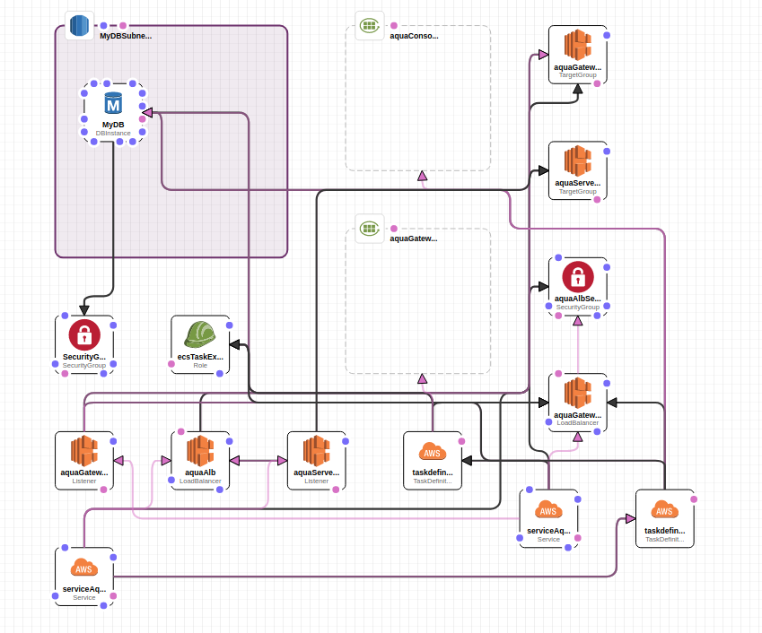

# Requirements:  

VPC with 2 subnets.  
ECS host security group.  

# Install
Push aquasec-server and aquasec-gateway to ECR.  
Modify parameters and run create-stack:

```
aws --region us-east-1 cloudformation create-stack --capabilities CAPABILITY_NAMED_IAM --stack-name aqua --template-body file://aquaFargate.json \
--parameters ParameterKey=cluster,ParameterValue=test \
ParameterKey=subnets,ParameterValue=\"subnet-xxxx,subnet-xxxx\" \
ParameterKey=vpcId,ParameterValue=vpc-xxxx \
ParameterKey=vpcSubnet,ParameterValue=xxxx \
ParameterKey=ecsHostSecurityGroup,ParameterValue=sg-xxxx \
ParameterKey=aquasecServerImage,ParameterValue=xxxx.dkr.ecr.us-east-1.amazonaws.com/test:aquasec-server-3.0 \
ParameterKey=aquasecGatewayImage,ParameterValue=xxxx.dkr.ecr.us-east-1.amazonaws.com/test:aquasec-gateway-3.0 \
ParameterKey=dbAllocatedStorage,ParameterValue=40 \
ParameterKey=dbPassword,ParameterValue=xxxx \
ParameterKey=dbUser,ParameterValue=aquaUser \
ParameterKey=multiAzDatabase,ParameterValue=true \
ParameterKey=myDbInstanceClass,ParameterValue=db.m3.medium \
ParameterKey=myDbName,ParameterValue=aqua \
ParameterKey=region,ParameterValue=us-east-1
```

# Screenshots

