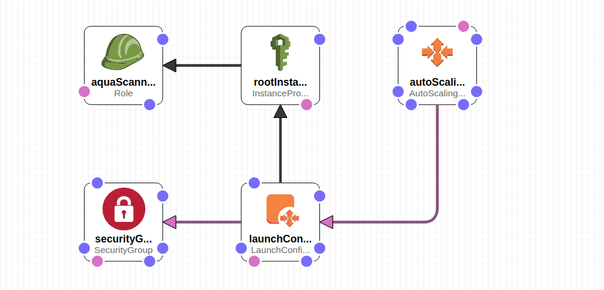

# Requirements:  

Create aqua scanner user.


# Install
Push aquasec-cli to ECR.  
Modify parameters and run create-stack:

```
aws --region us-west-2 cloudformation create-stack --capabilities CAPABILITY_NAMED_IAM --stack-name scannerDaemon --template-body file://aquaScannerDaemon.json \
--parameters ParameterKey=ebsSize,ParameterValue=100 \
ParameterKey=subnets,ParameterValue=\"subnet-xxxx,subnet-xxxx\" \
ParameterKey=instanceType,ParameterValue=xxxx \ 
ParameterKey=keyName,ParameterValue=xxxx \
ParameterKey=vpcId,ParameterValue=vpc-xxx \
ParameterKey=minSize,ParameterValue=1 \
ParameterKey=maxSize,ParameterValue=3 \
ParameterKey=scannerImage,ParameterValue=aqua:scanner-cli-3.0.2 \
ParameterKey=scannerUser,ParameterValue=scanner \
ParameterKey=scannerPassword,ParameterValue=xxxx \
ParameterKey=aquaConsoleUrl,ParameterValue=xxxx
```

# Screenshots

