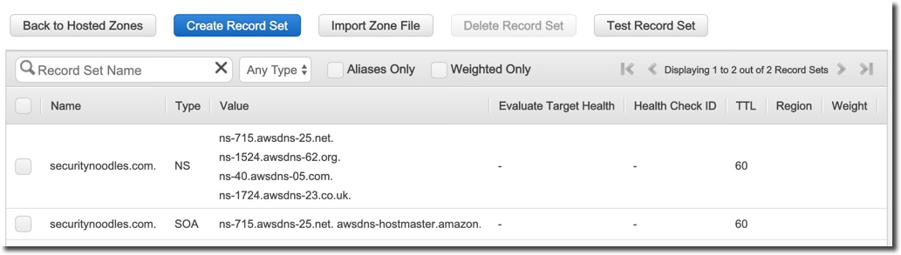

:terraform_version: v0.12.16

== Use of the TerraForm folder has been deprecated

= Terraform Aqua Security Build

* <<goals,Goals>>
* <<prerequisites,Prerequisites>>
* <<aws-preparation,AWS Preparation>>
** <<domain-name,Domain Name>>
** <<secrets,Secrets>>
** <<s3-bucket,S3 Bucket>>
** <<ec2-key-pair,EC2 Key Pair>>
* <<template-preparation,Template Preparation>>
** <<variable-and-files,Variables and Files>>
* <<terraform-version,Terraform Version>>
* <<gotchas,Gotchas>>
** <<aws-managed-role,AWS Managed Role>>
** <<aws-service-limits,AWS Service Limits>>
** <<unsupported-instance-configuration,Unsupported Instance Configuration>>
** <<The new ARN and resource ID format must be enabled to propagate tags,The new ARN and resource ID format must be enabled to propagate tags>>
* <<running-the-template-step-by-step,Running the Template Step-by-Step>>
* <<cleaning-up,Cleaning Up>>

== Goals

The main goal of this project is templatize a production ready Aqua Security build on AWS using Terraform using https://aws.amazon.com/ecs/[AWS ECS] (Elastic Container Service). While this template will likely require ongoing opitmizations, the end goal is to standardize a production level deployment on AWS for folks that just don't have the time and resources to start from scratch.

Since multi-AWS accounts are being used more and more (hint: they should be), this template is currently configured to support multi-AWS account scanning for https://aws.amazon.com/ecr/[AWS ECR] (Elastic Container Registry). For example, instead of using AWS access keys (which require periodic rotation) in other AWS accounts for ECR scanning, cross account IAM roles can be used instead.

== Prerequisites

Before you can use this template, you'll need to have a few things in place:

. Login credentials to https://my.aquasec.com so that you can download your license key and Aqua CSP containers. If you do not have this information, contact your Aqua Security account manager.

. A domain name registered and a hosted zone configured in AWS Route 53. You can purchase a domain name using AWS Route 53 or use a domain name that you've previously registered with another domain registrar. Below is an example of what this should look like in your AWS Route 53 console for a hosted zone:

[.center.text-center]

. Terraform installed on the computer that will execute this template. This template was created with Terraform version `{terraform_version}`. If you are new to Terraform, check out https://warrensbox.github.io/terraform-switcher/[Terraform Switcher] to help you get started.

. The AWS CLI configured on the computer that will deploy this template with Terraform.

. Understanding that successful deployment of this template is not free and you'll need to pay by the hour so make sure to following the instructions at <<cleaning-up,Cleaning Up>> when you are done testing.

== AWS Preparation

=== Domain Name

As mentioned in the <<prerequisites,Prerequisites>> section above, you'll need a domain name. You can easily https://aws.amazon.com/getting-started/tutorials/get-a-domain/[create and buy a domain name using Route 53] or you can add a domain name that you own to Route 53.

=== Secrets

Since we need to work with passwords and login credentials, we'll need to have various secrets stored in AWS Secrets Manager. Some of these secrets such as the Aqua Security login credentials will need to be provided to by Aqua Security so as mentioned in the <<prerequisites,Prerequisites>> section, make sure to contact your account manager if you don't have them. This template will use the default AWS managed `aws/ssm` KMS key and should be sufficient for most environments. The secrets that you need to prepare are:

* Username and Password for your Aqua Security account
* Your Aqua License Token
* A password for the Aqua CSP web console
* A password for your Aqua RDS PostgreSQL database

Here are some AWS CLI commands to help you set up these secrets. You are welcome to use the AWS Console but since you'll be working from the command line anyway, it might make sense to use the reference commands below. If this is the first time for you to setup anything in Secrets Manager, use the values for `--name` and `--description` unless you know exactly what you want:

[source,options="nowrap",subs="attributes"]
----
aws secretsmanager create-secret --region <<YOUR_TARGET_AWS_REGION>> --name aqua/container_repository \
--description "Username and Password for the Aqua Container Repository" \
--secret-string "{\"username\":\"<<YOUR_AQUA_USERNAME>>\",\"password\":\"<<YOUR_AQUA_PASSWORD>>\"}"
 
aws secretsmanager tag-resource --region <<YOUR_TARGET_AWS_REGION>> --secret-id aqua/container_repository \
    --tags "[{\"Key\": \"Owner\", \"Value\": \"<<YOUR_NAME>>\"}]"
  
aws secretsmanager create-secret --region <<YOUR_TARGET_AWS_REGION>> --name "aqua/admin_password" \
    --description "Aqua CSP Console Administrator Password" \
    --secret-string "<<ADMIN_PASSWORD>>"
 
aws secretsmanager tag-resource --region <<YOUR_TARGET_AWS_REGION>> --secret-id aqua/admin_password \
    --tags "[{\"Key\": \"Owner\", \"Value\": \"<<YOUR_NAME>>\"}]"
 
aws secretsmanager create-secret --region <<YOUR_TARGET_AWS_REGION>> --name "aqua/license_token" \
    --description "Aqua Security License" \
    --secret-string "<<LICENSE_TOKEN>>"
 
aws secretsmanager tag-resource --region <<YOUR_TARGET_AWS_REGION>> --secret-id aqua/license_token \
    --tags "[{\"Key\": \"Owner\", \"Value\": \"<<YOUR_NAME>>\"}]"
  
aws secretsmanager create-secret --region <<YOUR_TARGET_AWS_REGION>> --name "aqua/db_password" \
    --description "Aqua CSP Database Password" \
    --secret-string "<<YOUR_DB_PASSWORD>>"
 
aws secretsmanager tag-resource --region <<YOUR_TARGET_AWS_REGION>> --secret-id aqua/db_password \
    --tags "[{\"Key\": \"Owner\", \"Value\": \"<<YOUR_NAME>>\"}]"

----

Here is an example output when running the first command above with the profile `aquacsp` in the Tokyo AWS region.
Note that the password used in the command is a throw away:

[source,options="nowrap",subs="attributes"]
----
jeremyturner: aws secretsmanager --profile aquacsp create-secret --region ap-northeast-1 --name aqua/container_repository \
> --description "Username and Password for the Aqua Container Repository" \
> --secret-string "{\"username\":\"jeremy.turner@example.com\",\"password\":\"bfmD6uKvPC4Ew3NHR4yg\"}"
{
    "ARN": "arn:aws:secretsmanager:ap-northeast-1:XXXXXXXXXXXX:secret:aqua/container_repository-K20z2l",
    "Name": "aqua/container_repository",
    "VersionId": "b541db53-f450-444d-a618-081d1647baae"
}
----

If you opted to run the commands above instead of using the AWS Console, make sure to clear the commands that contain secrets out of your bash history with the following command:

`history -d &lt;line number to destroy&gt;`

Also, if you copy and paste these commands, make sure that you are performing those actions in plaintext since some characters can become incorrectly formatted and insert incorrect values into your AWS SSM store. A good example of this is quote marks: `”` and `&quot;`

Whatever method you use to setup your secrets, you should have something similar to the screenshot below:

[.center.text-center]

=== S3 Bucket

Next, you'll need an S3 bucket to store your terraform state. Remember that AWS S3 bucket names are global so you have to use unique bucket names. In other words, the bucket name I'm using in the example below will not work for you.

Using the administrator user `aquacsp` that I've configured in my AWS account, I've created the bucket `jturner-terraform-state` in the Tokyo region using the AWS CLI:

[source,options="nowrap",subs="attributes"]
----
jeremyturner: aws --profile aquacsp s3 mb s3://jturner-terraform-state --region ap-northeast-1
make_bucket: jturner-terraform-state
----

Use the following command to list the contents–at this point the S3 bucket should be empty:

[source,options="nowrap",subs="attributes"]
----
jeremyturner: aws --profile aquacsp s3 ls s3://jturner-terraform-state
jeremyturner:
----

Put the bucket name that you created in the file `aquacsp-infrastructure.config`. For my example, the contents of `aquacsp-infrastructure.config` will look like this when I use the Tokyo (ap-northeast-1) region:

[source,options="nowrap",subs="attributes"]
----
key="aquacsp/aquacsp-infrastructure.tfstate"
bucket="jturner-terraform-state"
region="ap-northeast-1"

----

=== EC2 Key Pair

You will also need to have an EC2 Key Pair configured so that you can launch instances for ECS. Don't forget to set the file permission on the private key with `chmod 400 &lt;private key file name&gt;`. The name of this key pair will be configured in the `terraform.tfvars` file for the variable `ssh-key_name`. In my case, I created a key pair and it's saved locally as `aquacsp-test-tokyo.pem` in my cloned `terraform-aqua-csp` folder. Therefore, my `ssh-key-name` variable will look like this:

[source,options="nowrap",subs="attributes"]
----
ssh-key-name = aquacsp-test-tokyo
----

Don't include the file extension `.pem`. Otherwise, you'll get the error:

`ValidationError: The key pair &#39;your-key-name.pem&#39; does not exist`

== Template Preparation

=== Variables and Files

Variables are located in the file `variables.tf` and you'll enter *_your_* values in the file `terraform.tfvars`.

Don't forget to enter *_your_* own values in the file `aquacsp-infrastructure.config` as mentioned in the <<s3-bucket,S3 Bucket>> section above.

Next, using the instructions in section <<ec2-key-pair,EC2 Key Pair>>, copy over your EC2 Key Pair into the `terraform` directory. In the example below, I have copied over `aquacsp-test-tokyo.pem`:

[source,options="nowrap",subs="attributes"]
----
jeremyturner: ls -lh
total 240
-rw-r--r--  1 jeremyturner  staff    23K Nov 23 00:04 README.md
-rw-r--r--  1 jeremyturner  staff   1.8K Nov  2 15:49 alb-console-public.tf
-rw-r--r--  1 jeremyturner  staff   1.6K Nov 22 15:37 alb-server-internal.tf
-rw-r--r--  1 jeremyturner  staff   101B Nov 22 23:59 aquacsp-infrastructure.config
-r--------@ 1 jeremyturner  staff   1.7K Nov 23 00:00 aquacsp-test-tokyo.pem
-rw-r--r--  1 jeremyturner  staff   2.3K Nov 22 22:35 asg-console.tf
-rw-r--r--  1 jeremyturner  staff   2.3K Nov 22 22:35 asg-gateway.tf
-rw-r--r--  1 jeremyturner  staff   1.5K Nov 22 18:19 cloudwatch-logs.tf
-rw-r--r--  1 jeremyturner  staff   1.3K Nov  2 15:49 dns.tf
-rw-r--r--  1 jeremyturner  staff   2.7K Nov 22 19:09 ecs-console.tf
-rw-r--r--  1 jeremyturner  staff   2.5K Nov 22 22:35 ecs-gateway.tf
-rw-r--r--  1 jeremyturner  staff   4.9K Nov 22 22:38 iam.tf
drwxr-xr-x  4 jeremyturner  staff   128B Nov 22 23:58 images
drwxr-xr-x  3 jeremyturner  staff    96B Nov 22 22:31 modules
-rw-r--r--  1 jeremyturner  staff   1.6K Nov 22 22:35 nlb-console.tf
-rw-r--r--  1 jeremyturner  staff   1.7K Nov 22 22:35 nlb-microenforcer-internal.tf
-rw-r--r--  1 jeremyturner  staff   184B Nov 22 21:20 outputs.tf
-rw-r--r--  1 jeremyturner  staff    76B Nov  2 15:43 provider.tf
-rw-r--r--  1 jeremyturner  staff   1.7K Nov 22 23:08 rds.tf
-rw-r--r--  1 jeremyturner  staff   1.0K Nov  2 15:39 secrets.tf
-rw-r--r--  1 jeremyturner  staff   6.4K Nov 22 22:35 security-groups.tf
drwxr-xr-x  4 jeremyturner  staff   128B Nov 22 21:17 task-definitions
-rw-r--r--  1 jeremyturner  staff   3.1K Nov 22 23:11 terraform.tfvars
drwxr-xr-x  3 jeremyturner  staff    96B Nov 22 22:38 userdata
-rw-r--r--  1 jeremyturner  staff   3.3K Nov 22 18:48 variables.tf
-rw-r--r--  1 jeremyturner  staff    45B Nov  2 15:33 versions.tf
-rw-r--r--  1 jeremyturner  staff   546B Nov 22 22:35 vpc.tf
----

Now input your values in the `terraform.tfvars` file.
Here is an example snippet of my values–note that I've left the variable`aqua_console_access` open to `0.0.0.0/0` since I'm only testing that my Terraform template works:

[source,options="nowrap",subs="attributes"]
----
#################################################
# Aqua CSP Project - INPUT REQUIRED
# Variables below assume Tokyo AWS Region
#################################################
region           = "ap-northeast-1"
resource_owner   = "Jeremy Turner"
project          = "aquacsp"
aquacsp_registry = "4.5.19318"

#################################################
# DNS Configuration - INPUT REQUIRED
# You must have already configured a domain name
# and hosted Zone in Route 53 for this to work!!!
#################################################
dns_domain   = "securitynoodles.com"
console_name = "aqua"

###################################################
# Security Group Configuration - INPUT REQUIRED
# Avoid leaving the Aqua CSP open to the world!!!
# Enter a list of IPs
# e.g. aqua_console_access = ["0.0.0.0/32", "0.0.0.0/32"]
###################################################
aqua_console_access = ["0.0.0.0/0"]
<snip>

#################################################
# EC2 Configuration - INPUT REQUIRED
# Don't add the .pem of the file name
#################################################
ssh-key_name  = "aquacsp-test-tokyo"
instance_type = "m5.large"

#################################################
# RDS Configuration - OPTIONAL INPUT REQUIRED
<snip>
----

Make sure to configure your `aquacsp-infrastructure.config` file as mentioned previously. Here is my configuration:

[source,options="nowrap",subs="attributes"]
----
key="aquacsp/aquacsp-infrastructure.tfstate"
bucket="jturner-terraform-state"
region="ap-northeast-1"
----

Now we need to make sure you have the correct version of Terraform. Since I'm using https://warrensbox.github.io/terraform-switcher/[Terraform Switcher], I'll simply run `tfswitch` and pick version `0.11.13`:

[source,options="nowrap",subs="attributes"]
----
jeremyturner: tfswitch 
✔ 0.12.16 *recent
Switched terraform to version "{terraform_version}"
----

== Terraform Version

As mentioned before, this template was run using Terraform `{terraform_version}`. This is an important distinction because different Terraform versions do not play well together.

== Gotchas

=== AWS Managed Role

There is a huge gotcha that you should know about before running this template. For whatever reason, the AWS managed role called `AWSServiceRoleForECS` doesn't exist until you create an ECS cluster in the AWS console or manually create it from the CLI:

[source,options="nowrap",subs="attributes"]
----
jeremyturner: aws --profile aquacsp iam get-role --role-name AWSServiceRoleForECS --region ap-northeast-1

An error occurred (NoSuchEntity) when calling the GetRole operation: The role with name AWSServiceRoleForECS cannot be found.
----

Here are the commands to create the role and check that it exists–note that I have snipped out some of the output for brevity:

[source,options="nowrap",subs="attributes"]
----
jeremyturner: aws --profile aquacsp iam create-service-linked-role --aws-service-name ecs.amazonaws.com
{
    "Role": {
        "Path": "/aws-service-role/ecs.amazonaws.com/",
        "RoleName": "AWSServiceRoleForECS",
 <snip>
 <snip>       
    }
}
jeremyturner: aws --profile aquacsp iam get-role --role-name AWSServiceRoleForECS --region ap-northeast-1
{
    "Role": {
        "Path": "/aws-service-role/ecs.amazonaws.com/",
        "RoleName": "AWSServiceRoleForECS",
        "RoleId": "AROAWAHJUXLUVPOGNQMJH",
        "Arn": "arn:aws:iam::XXXXXXXXXX:role/aws-service-role/ecs.amazonaws.com/AWSServiceRoleForECS",
        "CreateDate": "2019-08-15T14:25:23Z",
<snip>
<snip>
        "MaxSessionDuration": 3600
    }
}
----

Feel free to read the information from AWS called https://docs.aws.amazon.com/AmazonECS/latest/developerguide/using-service-linked-roles.html[Using Service-Linked Roles for Amazon ECS] to learn more about this behaviour.

=== AWS Service Limits

This often gets overlooked until it's too late but AWS won't let you create anything you want. This template makes uses of `m5.large` instances but some AWS accounts might have a quoto of zero for this size. Make sure to check out your service limits because this will prevent this template from working. Below is screenshot from AWS CloudTrail showing that the `RunInstances` *Event name* has an *Error code* of _Client.InstanceLimitExceeded_:

[.center.text-center]

== Unsupported Instance Configuration

This one is a bit tricky because as long as you haven't reached your service limits, you'd assume that you can launch any instance type that is supported by the ECS ami. This is not true and if you try to use an instance such as m3.large, you'll get an *Error code* of _Client.Unsupported_ in CloudTrail:

[.center.text-center]

Feel free to dig deeper into these messages using the CloudTrail console or the AWS CLI. Here is an AWS CLi command (make sure to replace or remove the `--profile` portion for your command) to help you get started looking for these type of errors but feel free to reference the https://docs.aws.amazon.com/cli/latest/reference/cloudtrail/lookup-events.html[lookup-events] AWS CLI documentation:

[source,options="nowrap",subs="attributes"]
----
aws --profile aquacsp cloudtrail lookup-events --lookup-attributes AttributeKey=EventName,AttributeValue=RunInstances --query 'Events[0:5]|[?contains(CloudTrailEvent, `errorCode`) == `true`]|[?contains(CloudTrailEvent, `errorMessage`) == `true`].[CloudTrailEvent]' --output text
----

=== The new ARN and resource ID format must be enabled to propagate tags

If you have an older AWS account you'll get this one when you try to apply your Terraform template:

[source,options="nowrap",subs="attributes"]
----
Error: InvalidParameterException: The new ARN and resource ID format must be enabled to propagate tags. Opt in to the new format and try again.
----

AWS has an article about this https://aws.amazon.com/blogs/compute/migrating-your-amazon-ecs-deployment-to-the-new-arn-and-resource-id-format-2/[Migrating your Amazon ECS deployment to the new ARN and resource ID format] that outlines what to do.
Below is a screenshot of making the setting for my IAM user–don't forget to save:

[.center.text-center]

== Running the Template Step-by-Step

At this point, you've completed the steps at <<aws-preparation,AWS Preparation>> and <<template-preparation,Template Preparation>>. Now it's time to do the Terraform stuff.

Since I've created the AWS CLI profile `aquacsp`, which maps to an administrator user called `aquacsp` in my AWS account, I'm going to need Terraform to run commands on that profile. I'll solve that problem by exporting my AWS CLI profile to the variable `AWS_PROFILE`:

[source,options="nowrap",subs="attributes"]
----
jeremyturner: export AWS_PROFILE=aquacsp
jeremyturner: echo $AWS_PROFILE
aquacsp
----

Note that in your environment, you'll probably have a different process. For example, some shops use a tool called https://github.com/Versent/saml2aws[saml2aws] with an identity provider such as https://jumpcloud.com/[JumpCloud] because they have multple AWS accounts running production services.

Now that you have your AWS profile configured, run the following `terraform init` command. 

Note that I have snipped out much of the output for brevity and this command might take a few minutes to complete the first time:

[source,options="nowrap",subs="attributes"]
----
jeremyturner: terraform init -backend-config="aquacsp-infrastructure.config"
Initializing modules...
Downloading terraform-aws-modules/autoscaling/aws 3.4.0 for asg-gateway...
- asg-gateway in .terraform/modules/asg-gateway/terraform-aws-modules-terraform-aws-autoscaling-07426a1
<snip>
Initializing the backend...

Successfully configured the backend "s3"! Terraform will automatically
use this backend unless the backend configuration changes.

Initializing provider plugins...
- Checking for available provider plugins...
- Downloading plugin for provider "random" (hashicorp/random) 2.2.1...
<snip>
Terraform has been successfully initialized!

You may now begin working with Terraform. Try running "terraform plan" to see
any changes that are required for your infrastructure. All Terraform commands
should now work.
<snip>
----

Now run the `terraform plan` command:

[source,options="nowrap",subs="attributes"]
----
jeremyturner: terraform plan
Refreshing Terraform state in-memory prior to plan...
The refreshed state will be used to calculate this plan, but will not be
persisted to local or remote state storage.

module.db.module.db_instance.data.aws_iam_policy_document.enhanced_monitoring: Refreshing state...
data.aws_kms_alias.secretsmanager: Refreshing state...
data.aws_iam_role.service-role-ecs-service: Refreshing state...
<snip>
<snip>
Plan: 97 to add, 0 to change, 0 to destroy.

------------------------------------------------------------------------
<snip>
----

And now it's time for the moment of truth…run the `terraform apply` command:

[source,options="nowrap",subs="attributes"]
----
jeremyturner: terraform apply
data.aws_iam_role.service-role-ecs-service: Refreshing state...
data.aws_secretsmanager_secret.license_token: Refreshing state...
data.aws_secretsmanager_secret.container_repository: Refreshing state...
<snip>
An execution plan has been generated and is shown below.
Resource actions are indicated with the following symbols:
  + create
 <= read (data resources)

Terraform will perform the following actions:
<snip>
Plan: 97 to add, 0 to change, 0 to destroy.

Do you want to perform these actions?
  Terraform will perform the actions described above.
  Only 'yes' will be accepted to approve.

  Enter a value: yes

module.vpc.aws_eip.nat[0]: Creating...
<snip>
Apply complete! Resources: 97 added, 0 changed, 0 destroyed.

Outputs:

console_url = [
  "aqua.securitynoodles.com",
]
gateway_url = internal-aquacsp-alb-gateway-2136472486.ap-northeast-1.elb.amazonaws.com
----

While the things are spinning up, head over to your CloudWatch Log Groups and search for the `/ecs/aquacsp/` group. Here you can see your logs for the console and gateway in case something doesn't go as expected:

[.center.text-center]

Your console should be accessible by whatever FQDN you configured. In my example it's `aqua.securitynoodles.com`:

[.center.text-center]

Login using the administrator password you set and stored in AWS Secrets manager. After logging in, make sure that the Aqua Gateway is connected:

[.center.text-center]

== Cleaning Up

Once you've tested everything, make sure to clean-up the resources your made. Otherwise, you'll be footing the bill for some beefy instances.

Run `terraform destroy` to delete all of the resources:

[source,options="nowrap",subs="attributes"]
----
jeremyturner: terraform destroy
module.vpc.aws_eip.nat[2]: Refreshing state... [id=eipalloc-0a7ea713170edef2f]
module.vpc.aws_eip.nat[1]: Refreshing state... [id=eipalloc-0226adf5b4224f8af]
<snip>
Plan: 0 to add, 0 to change, 97 to destroy.

Do you really want to destroy all resources?
  Terraform will destroy all your managed infrastructure, as shown above.
  There is no undo. Only 'yes' will be accepted to confirm.

  Enter a value: yes

aws_iam_role_policy_attachment.policy-attachment-ssm-ecs-instance: Destroying... [id=aquacsp-ecs-instance-iam-role-20191122155140505400000007]
aws_security_group_rule.postgres-gateway-ingress-rds: Destroying... [id=sgrule-3686711490]
<snip>
aws_iam_role.rds-enhanced-monitoring: Destruction complete after 1s

Destroy complete! Resources: 97 destroyed.
jeremyturner:
----